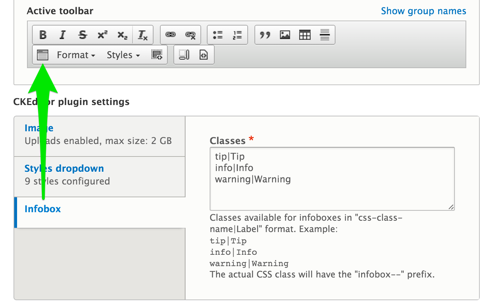
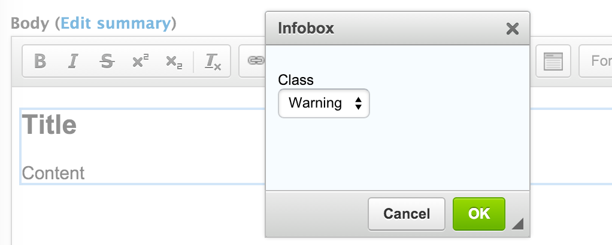

# CKEditor Infobox

A Drupal 8 module providing CKEditor Infobox plugin.

Infobox is a div having title and body. It also has additional CSS class selected by user from the list preconfigured on the text format.

## Screenshots

Admin UI (Administration > Configuration > Content authoring > Text formats and editors):

UI:

